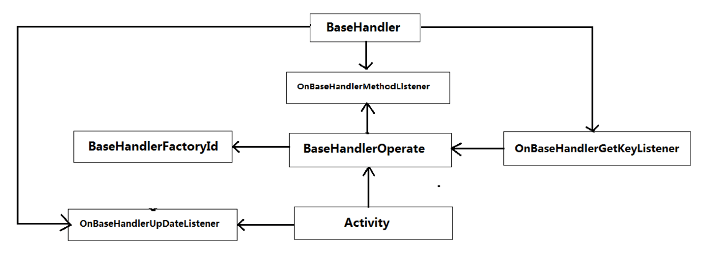

[](https://jitpack.io/#liqinew/handlerframe)
[](https://github.com/LiqiNew)

## HandlerFrame框架
 HandlerFrame是一个基于观察者模式采用信息分发机制去实现跨界面Handler通讯框架。只要在HandlerFrame里面订阅过的对象，在任何界面都可以发送信息去跟订阅对象通讯。
 且整个项目里面只存在一个Handler实例对象，不用担心因为Handler对象造成的内存问题。
 ## 架构图
 
 使用方法
-----

#### Gradle
**1：在项目根目录build.gradley**	<br>

```gradle
allprojects {
　　repositories {
  　　//依赖仓库
　　　maven { url 'https://jitpack.io' }
　　}
}
```

**2：依赖HandlerFrame框架**<br>

```gradle
compile 'com.github.liqinew:handlerframe:v1.0.0'
```

#### HandlerFrame框架使用简介
```java
//获取BaseHandler操作对象
BaseHandlerOperate.getBaseHandlerOperate()

//把OnBaseHandlerUpDateListener接口实现对象和指定对象订阅进Handler容器中
.onSubscribe(SubscribeObject,new OnBaseHandlerUpDateListener())

//给指定的界面发送Message
.sendMessage(AcceptTheObjectOfYheInformation, Message-What, SendTheMessageContent)

//移除（注销）指定订阅对象
.removeSubscribe(SubscribeObject)

//移除（注销）所有订阅对象
.removeSubscribe();
```
**“OnBaseHandlerUpDateListener”Handler信息接受回调更新接口**
```
实现OnBaseHandlerUpDateListener接口去接受传输的Message。
```
**如果觉得不错，请star给我动力。非常感谢**
### 如有问题，请查看我的博客文档
[我的博客](http://www.jianshu.com/p/e9fbb99593cb) 

# License

    Copyright 2017 Liqi

    Licensed under the Apache License, Version 2.0 (the "License");
    you may not use this file except in compliance with the License.
    You may obtain a copy of the License at

       http://www.apache.org/licenses/LICENSE-2.0

    Unless required by applicable law or agreed to in writing, software
    distributed under the License is distributed on an "AS IS" BASIS,
    WITHOUT WARRANTIES OR CONDITIONS OF ANY KIND, either express or implied.
    See the License for the specific language governing permissions and
    limitations under the License.
